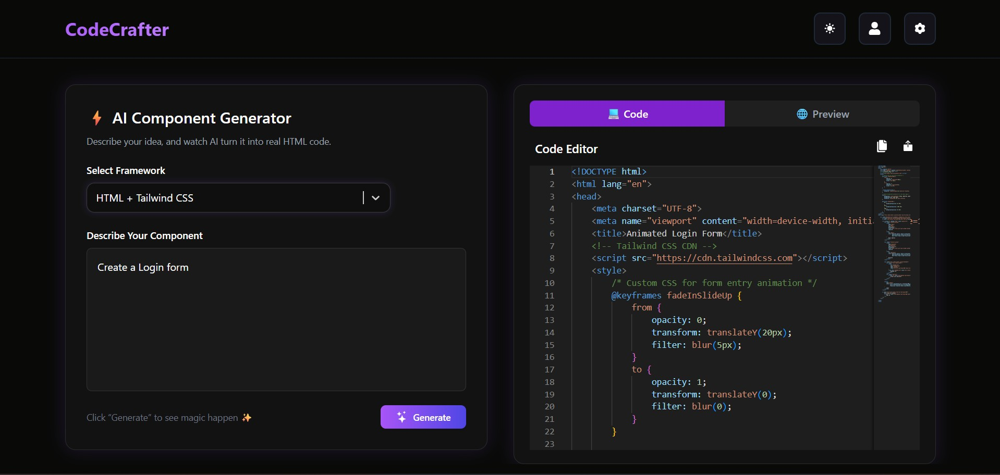
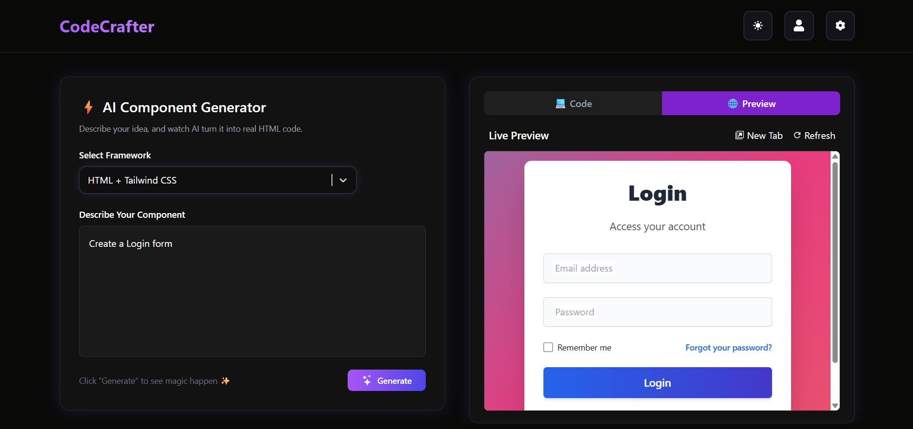

# CodeCrafter AI 🚀

 
 
 


**CodeCrafter AI** is a cutting-edge web app that allows you to generate **modern, responsive, and animated UI components** using AI. Describe a component, select your preferred framework, and instantly get clean code with a live preview.

---

## 🌟 Features

- ⚡ **AI-Powered Component Generation**: Generate HTML/CSS/JS components instantly.  
- 💻 **Monaco Code Editor**: Edit your component in a powerful editor.  
- 🌐 **Live Preview**: See your UI live while coding.  
- 🆕 **Full Preview Mode**: Open the component in a new tab for full view.  
- 📂 **Download Code**: Save the component as a ready-to-use HTML file.  
- 🖱️ **Copy to Clipboard**: Copy generated code with a single click.  
- 🎨 **Framework Support**: HTML + CSS, Tailwind, Bootstrap, or combinations.  
- ✨ **Modern UI**: Dark mode interface with smooth animations, hover effects, and shadows.

---

## ⚙️ Technologies Used

- **Frontend**: React, Vite, Tailwind CSS, React Select  
- **Editor**: Monaco Editor  
- **AI Backend**: Google Gemini API  
- **Icons & UI**: React Icons, TailwindCSS  
- **Notifications**: React Toastify  
- **Loader**: React Spinners  
- **Deployment**: Render (Static Web Service)

---

## 📸 Screenshots

### Code Editor


### Live Preview


---

## 🚀 Live Demo
[View Live Demo](https://codecrafter-ai.onrender.com)

---

## 💻 Installation

1. **Clone the repository**
```bash
git clone https://github.com/alimehdi13347/CodeCrafter.git

